# Le Back

### Requête SQL vide

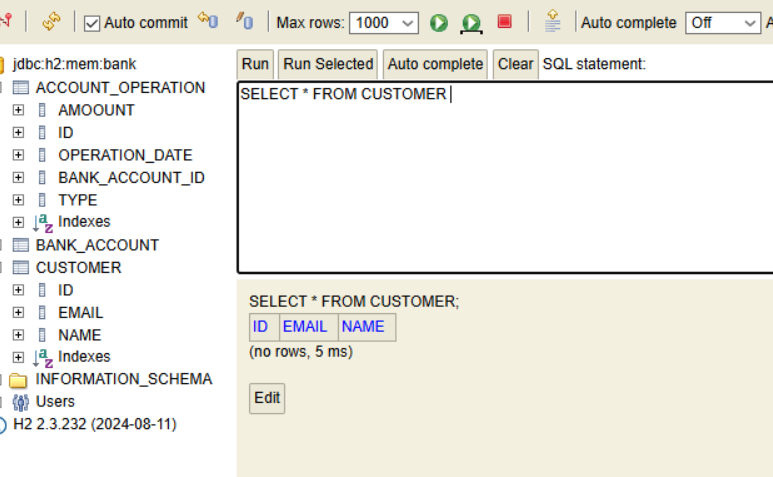

Description : Interface H2 Database avec une requête qui ne retourne aucun résultat  
- Connexion à la base H2 en mémoire: `jdbc:h2:mem:bank`  
- Structure visible: tables `ACCOUNT_OPERATION`, `BANK_ACCOUNT`, `CUSTOMER`  
- La requête `SELECT * FROM CUSTOMER` ne retourne aucune ligne

---

### Requête SQL avec résultats

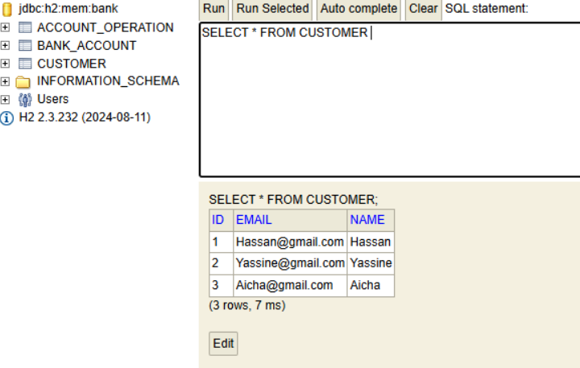

Description : Requête SQL affichant 3 clients  
- Même base H2 que ebank6  
- Clients : Hassan, Yassine, Aicha  
- Incohérence avec les autres captures → sessions différentes ?

---

### Opérations bancaires

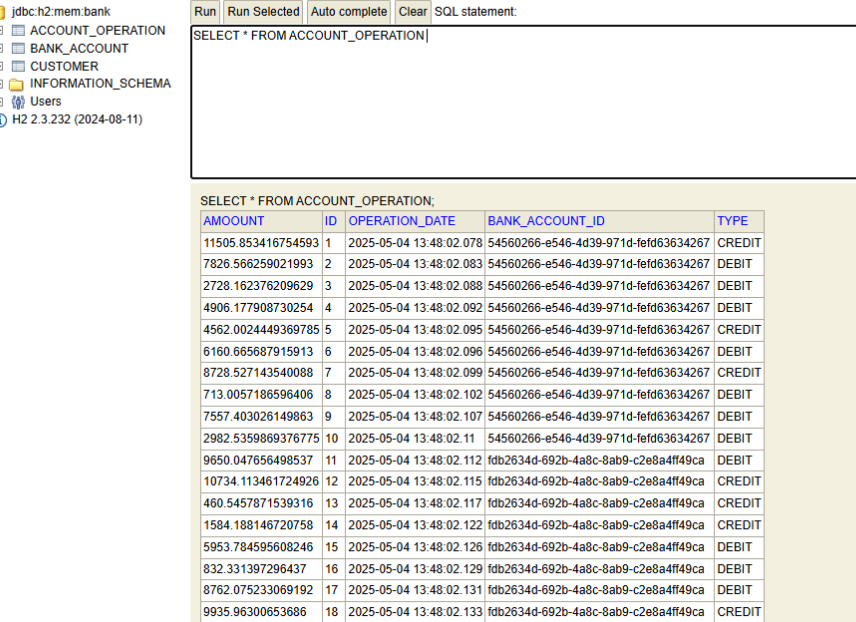

Description : Table `ACCOUNT_OPERATION` avec 18 opérations  
- Montants, dates, types (CREDIT/DEBIT), comptes UUID  
- Toutes datées du 04/05/2025 avec timestamps précis

---

### Création d'un client

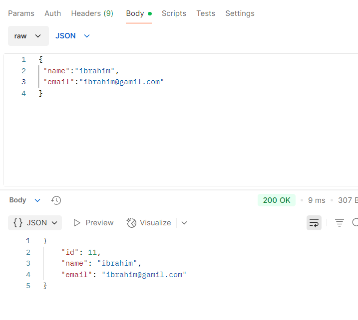

Description : Requête POST pour créer un client via l'API REST  
- Endpoint: `http://localhost:8085/customers`  
- Méthode: POST  
- Données : name="ibrahim", email="ibrahim@gamil.com"  
- Réponse : 200 OK, client créé avec `id=11`, Temps : 9 ms

---

### Liste des clients (format incorrect)

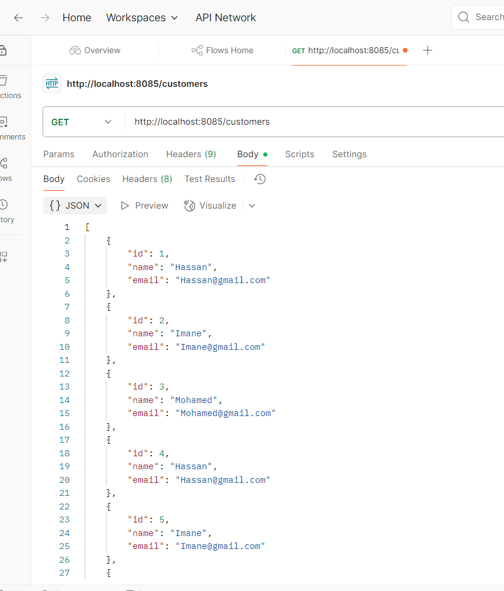

Description : GET `/customers` retourne un JSON malformé  
- Problème de syntaxe (accolades/virgules)  
- Affiche tout de même les clients avec leurs infos

---

### Liste des clients (navigateur)

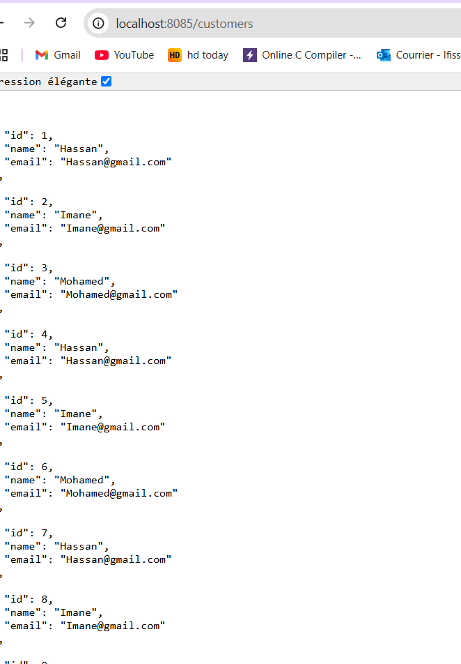

Description : Affichage HTML de `/customers`  
- 8 clients listés avec leurs ID, nom, email  
- Présence de "..." → d'autres clients cachés

---

### Création d’un autre client

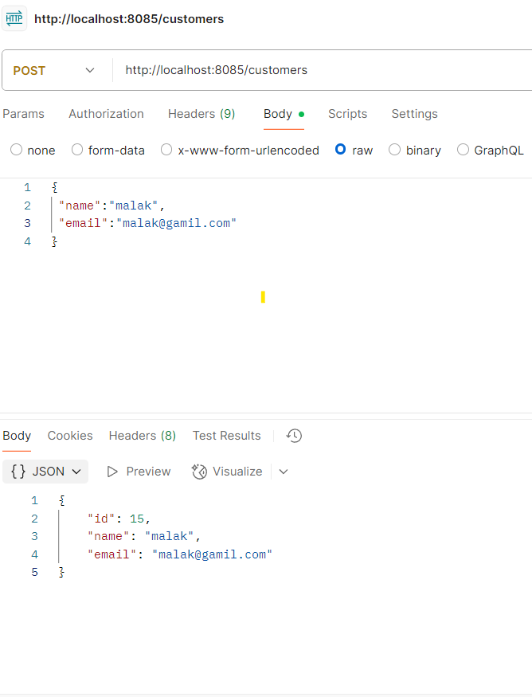

Description : POST `/customers` avec  
- name="malak", email="malak@gamil.com"  
- Réponse : `id=15`  
- ⚠️ Typo : "gamil.com" au lieu de "gmail.com"

---

### Suite de la liste des clients

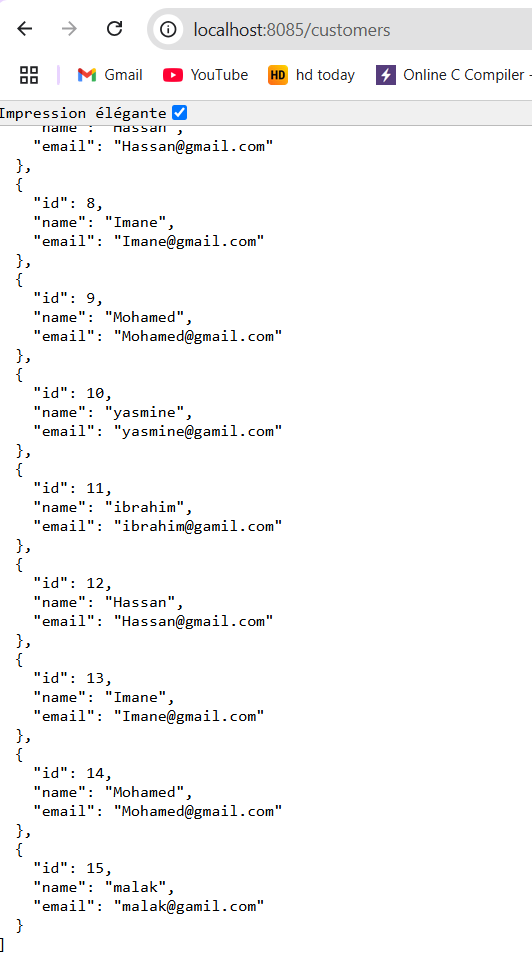

Description : Clients affichés de id=8 à id=15  
- Confirme que "ibrahim" et "malak" ont été créés

---

# Le Front

### Interface de recherche clients

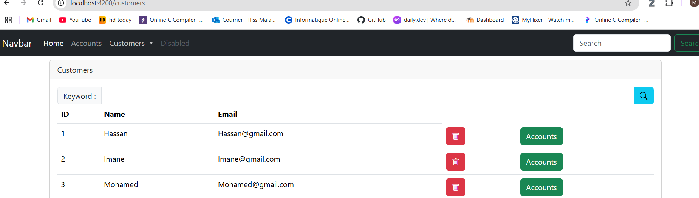

Description :  
- Barre de recherche  
- Tableau des clients (ID, Name, Email)  
- 3 clients : Hassan, Imane, Mohamed

---

### Liste des clients (frontend)

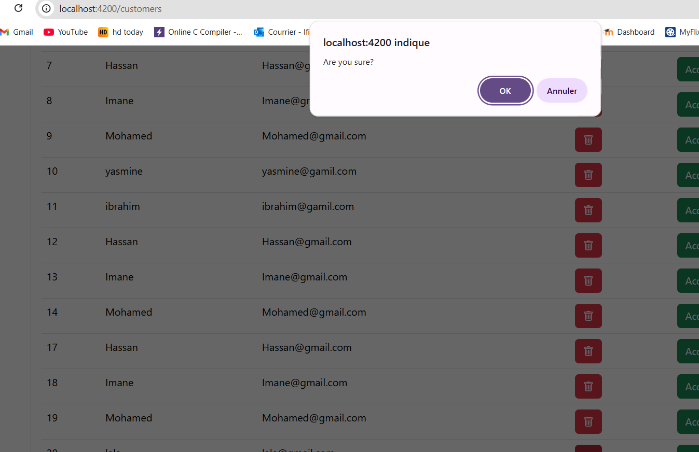

Description : Interface Angular `localhost:4200`  
- Clients de ID 7 à 19  
- Boutons de confirmation (OK/Annuler)  
- Menu : Dashboard, MyFib, etc.

---

### Recherche de client

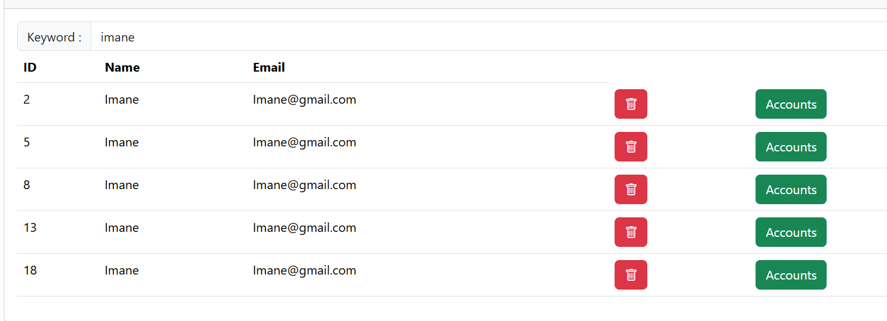

Description :  
- Recherche du mot-clé "image"  
- 5 clients "Image" affichés → filtre fonctionnel

---

### Création de client réussie

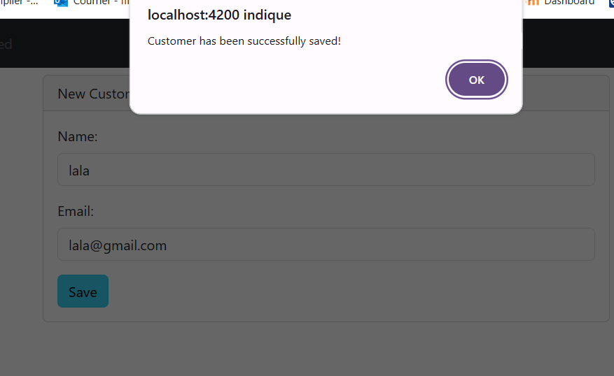

Description :  
- Message : "Customer has been successfully saved!"  
- Client "lala" (lala@gmail.com)  
- Bouton "Save"

---

### Liste des derniers clients

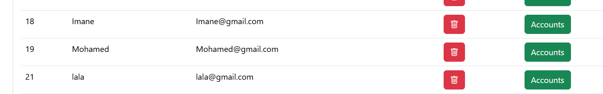

Description :  
- Clients : 18 (Imane), 19 (Mohamed), 21 (lala)  
- Bouton/lien "Accounts" présent

---

### Détails d'un compte bancaire

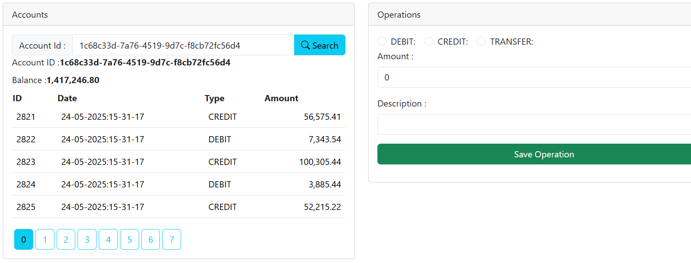

Description :  
- Compte ID : `1c68c33d-7a76-4519-9d7c-f8cb72fc56d4`  
- Solde : 1,417,246.80  
- 5 dernières opérations listées  
- Formulaire pour nouvelle opération

---

## 🧠 Synthèse technique

Le projet complet comprend :

### ✅ Backend Spring Boot
- API REST pour la gestion des clients (CRUD)
- Gestion des comptes bancaires et opérations
- Base H2 en mémoire avec schéma relationnel

### ✅ Frontend Angular
- Interface sur `localhost:4200`
- Fonctionnalités : liste, recherche, création de clients
- Visualisation des comptes et opérations
- Exécution d'opérations bancaires

### 🧱 Modèle de données
- **Clients** : ID, nom, email  
- **Comptes** : ID (UUID), solde  
- **Opérations** : montant, type, date, compte_id

### 🔄 Flux complet
Créer un client → lui associer un compte → effectuer des opérations → consulter l’historique

---